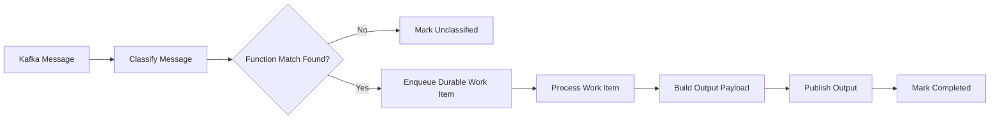
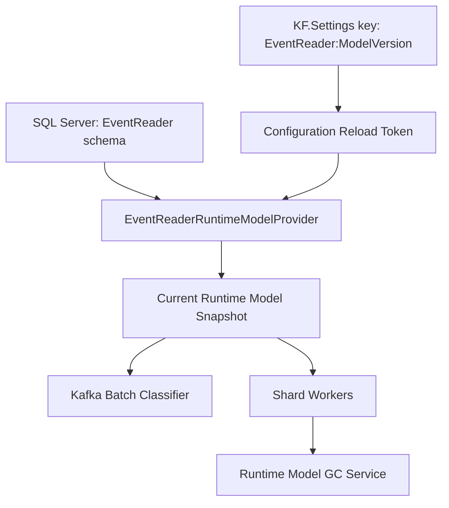
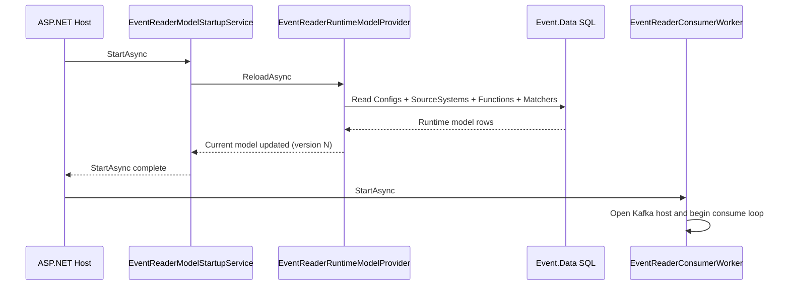
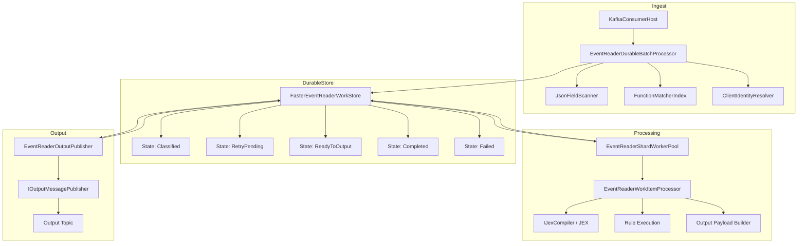
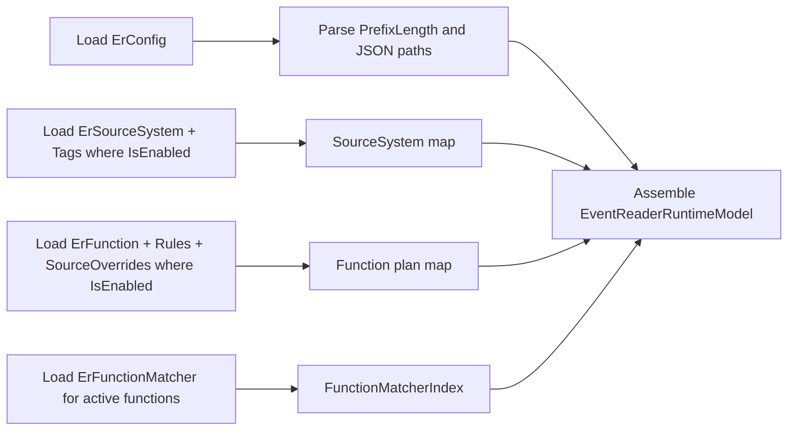
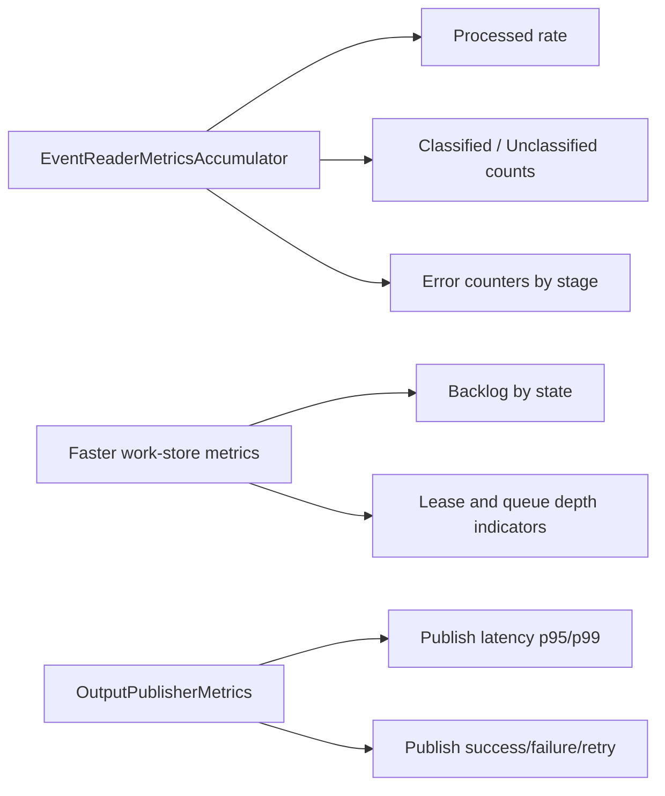
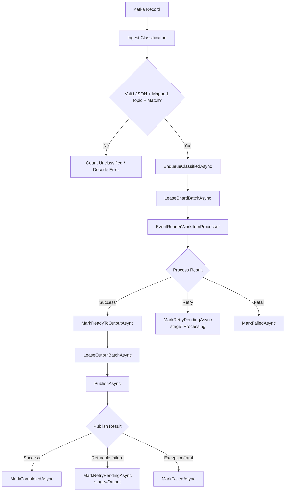

# EventReader Message Processing Architecture

This document explains how EventReader processes messages from Kafka through durable staging, processing, and output publication.

## 0) What Happens To Your Message (Abstraction-First)

This is the shortest accurate version of the flow:

1. Parse and classify incoming Kafka records.
2. Batch-ingest records from Kafka and enqueue matched records into the durable queue.
3. Lease work items in shard batches and run extraction + rules per leased item.
4. Batch-lease output-ready items for publication.
5. Publish to Kafka and mark durable state as Completed (or retry/fail).

Class mapping for those five steps:

- Step 1 and 2: `EventReaderDurableBatchProcessor` in [apps/EventReader/src/EventReader/Kafka/EventReaderDurableBatchProcessor.cs](apps/EventReader/src/EventReader/Kafka/EventReaderDurableBatchProcessor.cs)
- Step 3: `EventReaderShardWorkerPool` + `EventReaderWorkItemProcessor` in [apps/EventReader/src/EventReader/Kafka/EventReaderShardWorkerPool.cs](apps/EventReader/src/EventReader/Kafka/EventReaderShardWorkerPool.cs) and [apps/EventReader/src/EventReader/Kafka/EventReaderWorkItemProcessor.cs](apps/EventReader/src/EventReader/Kafka/EventReaderWorkItemProcessor.cs)
- Step 4 and 5: `EventReaderOutputPublisher` in [apps/EventReader/src/EventReader/Kafka/EventReaderOutputPublisher.cs](apps/EventReader/src/EventReader/Kafka/EventReaderOutputPublisher.cs)

## 0.1) Queue Entry And Exit Points (Exact)

Where an item is added to durable queue:
- Added in classification stage via `EnqueueClassifiedAsync(...)` in [apps/EventReader/src/EventReader/Kafka/EventReaderDurableBatchProcessor.cs](apps/EventReader/src/EventReader/Kafka/EventReaderDurableBatchProcessor.cs)

Where an item leaves active queue states:
- Processing success: `MarkReadyToOutputAsync(...)` in [apps/EventReader/src/EventReader/Kafka/EventReaderShardWorkerPool.cs](apps/EventReader/src/EventReader/Kafka/EventReaderShardWorkerPool.cs)
- Output publish success: `MarkCompletedAsync(...)` in [apps/EventReader/src/EventReader/Kafka/EventReaderOutputPublisher.cs](apps/EventReader/src/EventReader/Kafka/EventReaderOutputPublisher.cs)
- Retry paths: `MarkRetryPendingAsync(...)` in both processing and output stages
- Terminal failure: `MarkFailedAsync(...)` in processing/output exception paths

Practical interpretation:
- "Added to queue" means state `Classified` was persisted.
- "Removed from active processing" means state reached `Completed` or `Failed`.

## 0.2) Batching Boundaries (What Is Batched, What Is Not)

Ingest batching:
- Kafka host delivers record batches to `EventReaderDurableBatchProcessor.ProcessAsync(...)`.
- Batch size is controlled by Kafka profile extended consumer options (`MaxBatchSize`, `MaxBatchWaitMs`).

Processing batching:
- Workers lease a batch per shard using `LeaseShardBatchAsync(shardId, batchSize, ...)`.
- `batchSize` comes from `EventReaderShardWorkerPoolOptions.BatchSize`.
- Extraction and rules are still executed per individual work item, not vectorized across a batch.

Output batching:
- Publisher leases output items using `LeaseOutputBatchAsync(batchSize, ...)`.
- Batch size comes from `EventReaderOutputPublisherOptions.BatchSize`.
- Publish call is currently per leased output item (`PublishAsync` invoked item-by-item inside the leased batch loop).

## 0.3) Parse / Rule Timing (Important)

Parsing occurs in two places for different purposes:

- First parse (classification parse): during ingest in `EventReaderDurableBatchProcessor`.
    - Uses `JsonFieldScanner` over configured discriminator and identity paths.
    - Decides function match + identity and whether item is enqueued.

- Second parse (full payload parse): during processing in `EventReaderWorkItemProcessor`.
    - Parses full payload into `JObject` before extraction/rules.
    - Runs extraction JEX and rule generation for the matched function.

So the system does not "run rules on the Kafka ingest batch". It runs rules per durable work item after dequeue/lease.

## 1) Logical Flow (Business-Level)

Notes:
- Classification maps topic + discriminator fields to a function.
- Unclassified messages are counted and observed, but not transformed.
- Durable work store is the system of record for in-flight state.

## 2) Runtime Model Control Plane

Notes:
- Runtime model entities are stored in SQL, not in IConfiguration payload trees.
- KF.Settings only acts as a version-change trigger signal.
- On startup, EventReader now performs an eager model load before consumers run.

## 3) Startup and Hosted Service Sequencing

Notes:
- Because startup loading is an IHostedService StartAsync step, host startup awaits it.
- This avoids long windows where the runtime model stays empty at version 0.

## 4) Detailed Data Plane (Physical)

State transitions:
- Classified -> ReadyToOutput on successful processing.
- Classified -> RetryPending on transient failures.
- ReadyToOutput -> Completed on publish success.
- ReadyToOutput -> RetryPending on publish retry condition.
- RetryPending -> Classified or ReadyToOutput depending on retry phase.

## 5) Runtime Model Load Detail

Validation checkpoints:
- Empty model is allowed for cold start.
- Functions without any source systems are rejected.
- Matchers pointing to missing functions are rejected.

## 6) Operational Observability

Recommended dashboards:
- Ingest throughput and unclassified ratio.
- Backlog by work state over time.
- Processing and publish retry rates.
- Runtime model version currently active and number of retained versions.

## 7) Error Flow (End-to-End)

Error handling behavior summary:
- Ingest/classification non-match scenarios are not retried; they become unclassified observations.
- Processing-stage retriable failures move back to retry pipeline from `Classified` stage.
- Output-stage retriable failures move back to retry pipeline from `ReadyToOutput` stage.
- Fatal/exception paths are marked failed to avoid infinite loops.
